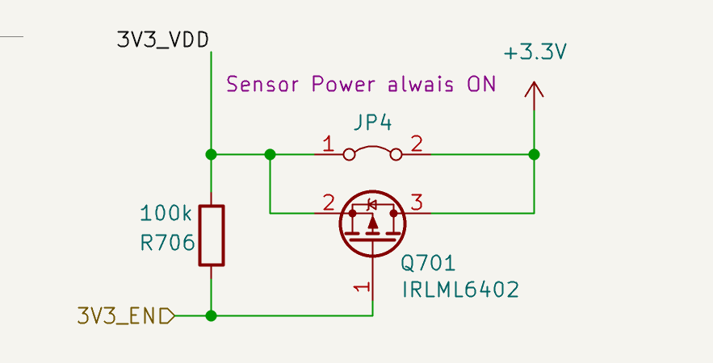
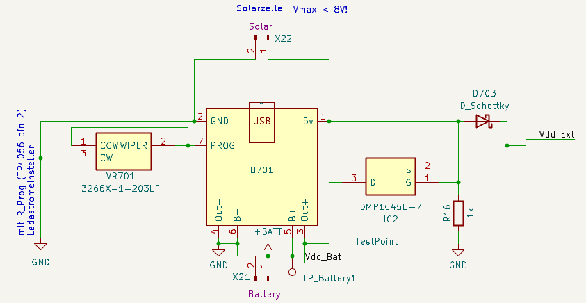
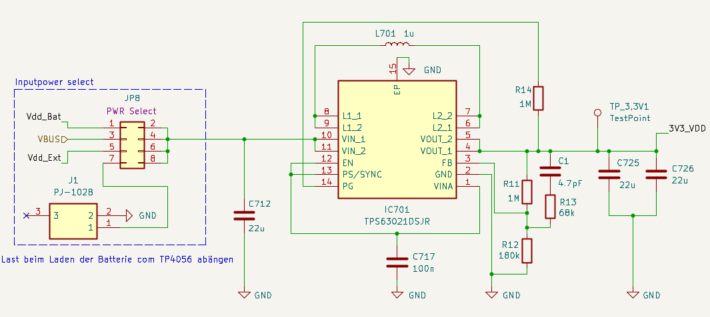
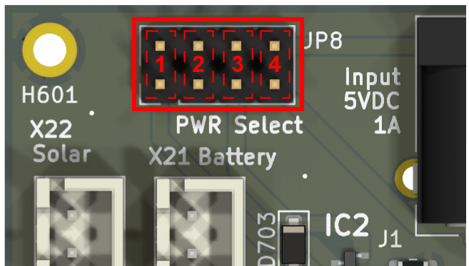
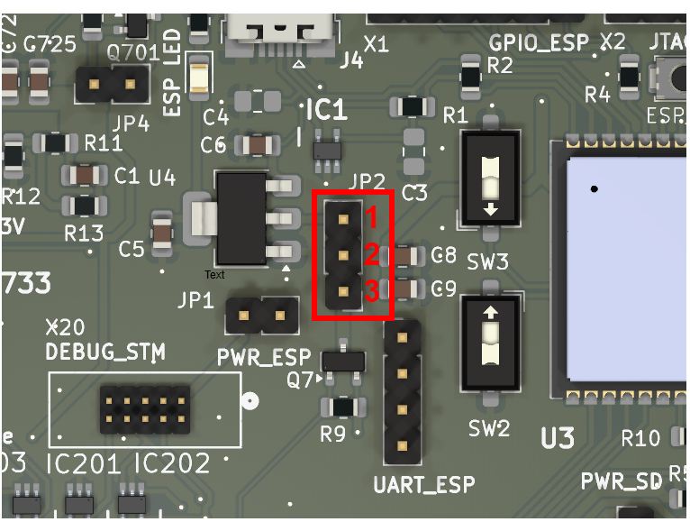
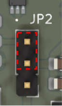
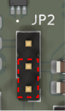

# Power Control

This document describes how the power management on the uC_Agri-PV board works. The STM32 can control the power supply for most parts on the board. This allows to save energy by turning off unused components.

## Jumper Control

### Power Lanes

The board has three 3.3V power lanes:

| Lane    | Description                                           |
| ------- | ----------------------------------------------------- |
| 3V3_VDD | Always powered - for essential components             |
| +3.3V   | Switchable lane - for sensors and peripherals         |
| VDD_MCU | Only for the MCU - connected over JP2 to 3V3_VDD lane |

#### 3.3V Lane Control (JP4)

The +3.3V lane can be controlled by the STM32 or permanently enabled with a jumper.

| Mode | JP4 | STM32 (PB15) | +3.3V Lane | Use Case |
| ---- | --- | ------------ | ---------- | -------- |
| Always ON | closed | ignored | always powered | Simple operation, no power saving |
| MCU controlled | open | LOW = ON, HIGH = OFF | STM32 controlled | Low power operation |

**How it works:**

- **JP4 closed:** The jumper bridges 3V3_VDD directly to +3.3V, the MOSFET is bypassed
- **JP4 open:** The STM32 controls the P-MOSFET (Q701) via PB15 (Active Low)

**Recommendation:** For low power applications keep JP4 open so the STM32 can turn off the +3.3V lane during deep sleep.

### Enable Jumper

The board has some Enable Jumper pins to measure the current for research purposes.

**How it works:**
- **Jumper closed:** Normal operation, current flows through the jumper
- **Jumper open:** You can connect a multimeter in series to measure the current consumption

For common use it is **recommended to close all Jumper pins**.

| Jumper | Name     | Necessary for using        |
| ------ | -------- | -------------------------- |
| JP1    | PWR_ESP  | ESP32                      |
| JP2    | PWR_MCU  | STM32 (Always recommended) |
| JP3    | PWR_SD   | uSD Card slot              |
| JP7    | LORA PWR | LoRa E5 module             |
| JP6    | LED PWR  | LEDs next to LoRa E5 module |

## STM32 Power Control Pins

The STM32 can control the power supply for nearly every part on the board. To activate a part it is important to check if there is a **necessary Enable Jumper**.

**Note:** All power control pins are **Active Low**. This means:
- Pin = LOW (0) → Power is ON
- Pin = HIGH (1) → Power is OFF

### On-board Power Control Pins

| Part      | STM32 PIN | Active | Comment                         |
| --------- | --------- | ------ | ------------------------------- |
| SD_EN     | PA8       | LOW    | Micro SD card slot              |
| ESP32     | PD5       | LOW    | ESP32 module                    |
| LoRa E5   | PD13      | LOW    | LoRa E5 communication module    |
| 3V3 OPV   | PG1       | LOW    | 3.3V for operational amplifiers |
| 3.3V Lane | PB15      | LOW    | General 3.3V power lane         |

### Sensors Power Control Pins

Each sensor has its own power control pin. This allows to power only the sensors you need.

| Sensor           | STM32 PIN | Active | Comment                        |
| ---------------- | --------- | ------ | ------------------------------ |
| Wind             | PB0       | LOW | Wind speed sensor              |
| UV               | PB5       | LOW | UV radiation sensor            |
| PAR              | PB10      | LOW | Photosynthetically Active Radiation |
| Soil Moisture    | PB11      | LOW | Soil moisture sensor           |
| Soil Temperature | PB13      | LOW | Soil temperature sensor        |
| BME680           | PB14      | LOW | BME680 air temperature/humidity/pressure |

## Power Select

### Power Supply Chain

The board uses a two-stage power architecture:

1. **Battery Charger (TP4056)** – Charges the LiPo battery from solar input and provides Power-Path Load-Sharing
2. **Buck-Boost Converter (TPS63021)** – Regulates the selected input voltage to stable 3.3V (3V3_VDD)

#### Battery Charger & Power-Path (TP4056)

The TP4056 charges the battery from the solar input (X22). The Power-Path circuit (MOSFET + Schottky diode) provides two voltage sources:

| Output  | Source |
| ------- | ------ |
| Vdd_Bat | Direct battery voltage (3.0–4.2V) |
| Vdd_Ext | Power-Path output – Solar when available, otherwise battery |

#### Buck-Boost Converter (TPS63021)

The selected voltage source is regulated to 3.3V by the Buck-Boost converter. Use the **PWR Select** jumper (JP8) to choose the input.

### Board Power Supply (JP8)

| Position | Pins | Power Source | Description |
| -------- | ---- | ------------ | ----------- |
| 1 | 1-2 | Vdd_Bat | Direct battery voltage (3.0–4.2V). The Buck-Boost converter is fed directly from the LiPo cell. Drawback: When charging and powering the load simultaneously, current flows into the battery and out to the load – more inefficient and increased cycle stress. |
| 2 | 3-4 | Vdd_USB | USB 5V from the J601 micro USB plug |
| 3 | 5-6 | Vdd_Ext | Output of the Power-Path Load-Sharing (MOSFET + Schottky). Automatic source selection: With solar supply the load is powered directly, allowing the battery to charge unloaded. Without solar the battery takes over seamlessly. **Recommended setting for autonomous battery operation.** |
| 4 | 7-8 | 5V_Input | External 5V DC jack J1 (1A max). For stationary operation with external power supply. |

**Note:** Only select ONE power source at a time.

### ESP32 Power (JP2)

The ESP32 module can be powered in two different ways. Use the **JP2** jumper to select the power mode.

#### Option A: MCU-controlled (recommended for normal operation)

| Pins | Connection   | Function                                       |
| ---- | ------------ | ---------------------------------------------- |
| 1-2  | MOSFET → Vdd | ESP32 power is MCU-controlled (for deep sleep) |

The STM32 can turn off the ESP32 during deep sleep to save power.

#### Option B: USB powered (recommended for debugging)

| Pins | Connection | Function                                           |
| ---- | ---------- | -------------------------------------------------- |
| 2-3  | USB → Vdd  | ESP32 powered when USB connected on J4 (debug mode) |

The ESP32 stays powered via USB independent of the STM32.

**WARNING:** Do not bridge all three pins simultaneously - this can cause backfeed current through the MOSFET body diode.
