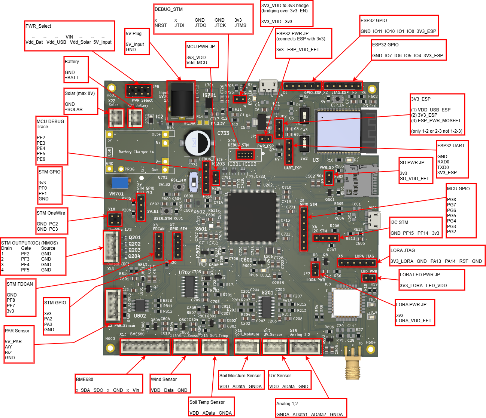

# uC_Agri-PV

**Low-Power Sensor Board for Agri-Photovoltaic Research**

A custom PCB designed for environmental monitoring in agricultural photovoltaic installations. Built around the STM32U5 ultra-low-power microcontroller with LoRaWAN connectivity and multiple sensor interfaces.

---

## Features

- **Ultra-Low Power Design** - Optimized for battery-powered field deployment with deep sleep support
- **LoRaWAN Connectivity** - Seeed LoRa-E5 module for long-range wireless data transmission
- **Multiple Sensor Interfaces** - ADC, I2C, OneWire, RS485 for various environmental sensors
- **Switchable Power Rails** - Individual MOSFET-controlled power for each sensor to minimize standby current
- **Local Data Storage** - MicroSD card slot for data logging
- **Flexible Power Input** - Battery, solar panel, or 5V DC input with integrated charging

---

## Hardware Specifications

| Component | Description |
|-----------|-------------|
| **MCU** | STM32U575ZIT6Q (ARM Cortex-M33, 160 MHz, ultra-low power) |
| **Wireless** | Seeed LoRa-E5 (STM32WLE5 + SX1262, LoRaWAN) |
| **WiFi/BLE** | ESP32-C6-WROOM-1-N8 (optional, MCU-controlled power) |
| **Storage** | MicroSD card slot (SDMMC 4-bit) |
| **Power** | Li-Ion battery (TP4056 charger), solar input, 5V DC |
| **RTC Backup** | SuperCap (FC0V104ZFTBR24) for timekeeping during power loss |

---

## Supported Sensors

| Sensor | Interface |
|--------|-----------|
| PAR (Photosynthetically Active Radiation) | RS485 |
| UV Radiation | ADC |
| Soil Moisture | ADC |
| Soil Temperature (DS18B20) | OneWire |
| Wind Speed (Anemometer) | ADC |
| BME680 (Temp, Humidity, Pressure, Gas) | I2C |
| Generic Analog (2 channels) | ADC |

All sensor power rails are individually switchable via GPIO-controlled MOSFETs for minimal deep sleep current consumption.

---

## Pin Definition

For detailed GPIO mappings and communication protocols, see **[Hardware Pinout Documentation](HARDWARE_PINOUT.md)**.

---

## Power Management

The board has flexible power options and MCU-controlled power switching for low-power operation.

For detailed information about power input selection, jumper settings, and GPIO power control see **[Power Control Documentation](POWER_CONTROL.md)**.

---

## Connectors Overview

### Debug & Programming

| Connector | Function |
|-----------|----------|
| X20 (DEBUG_STM) | 10-pin ARM Cortex SWD |
| JTAG_ESP | ESP32-C6 programming header |
| LORA JTAG | LoRa-E5 programming header |
| UART_ESP | ESP32 UART (RXD0, TXD0) |

### GPIO/UART Headers

| Connector | Signals |
|-----------|---------|
| X7 (GPIO STM) | STM32 GPIOs for UART debugging or other UART devices |
| X5 (GPIO STM) | Additional STM32 GPIOs |
| X4 (I2C STM) | I2C bus expansion |
| GPIO_ESP | ESP32-C6 GPIO breakout |

---

## Documentation

- **[Hardware Pinout](HARDWARE_PINOUT.md)** - GPIO assignments, sensor data pins, communication protocols
- **[Power Control](POWER_CONTROL.md)** - Power input selection, jumper settings, GPIO power switching
- **[Changelog](CHANGELOG.md)** - Version history and changes between revisions
- **[Interactive BOM](https://derschweigefuchs.github.io/uC_Agri-PV/bom/ibom.html)** - Component placement of materials

---

## Version History

| Version | Date | Description |
|---------|------|-------------|
| v2.0 | 2026-01-08 | Complete redesign with optimized power management |
| v1.3 | 2025-12-18 | Intermediate version (never produced) |
| v1.2 | 2025 | Initial release |

See **[CHANGELOG.md](CHANGELOG.md)** for detailed changes.

---

## License

This hardware design is part of a master's thesis of the University of Applied Science Karlsruhe of the project for Agri-PV research.

---

